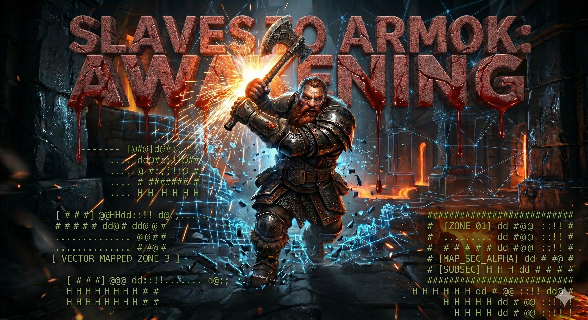

# Slaves to Armok: Awakening


> *"Strike the earth, and awaken the simulation."*

## Overview

**Slaves to Armok: Awakening** is a next-generation 3D and VR interface for *Dwarf Fortress* Adventure Mode. 

Rather than attempting to rebuild the legendary, hyper-granular simulation of *Dwarf Fortress*, this project acts as a "puppet master." It utilizes a decoupled Client-Server-AI architecture to project the live, 2D game state into a fully immersive, physics-driven VR environment in Godot 4. 

By replacing clunky spreadsheet menus with deterministic spatial physics and a local AI translation layer, *Awakening* allows players to naturally speak to NPCs and physically swing their weapons, all while the pristine, uncompromised *Dwarf Fortress* engine dictates the logic in the background.

---

## Core Features

* **Deterministic Spatial Combat:** No AI guesswork. *Awakening* maps 3D colliders 1:1 with DF's anatomical body parts. Physically strike a goblin's left arm in VR, and the client instantly injects the exact menu sequence (`Attack -> Goblin -> Left Upper Arm -> Slash`) into the DF engine.
* **The AI Translation Layer:** Menu-driven dialogue is hidden behind a natural voice interface. Speak to your microphone, let Whisper (STT) transcribe it, and allow a local LLM to instantly map your intent to the available DF conversation options.
* **Immersive Output:** The dry, mechanical combat and dialogue logs generated by DF are rewritten by the LLM into immersive, first-person flavor text and spoken back to you via TTS.
* **1:1 World Generation:** Dynamic 3D meshing of DF's 16x16 map blocks, transmitted only within the player's Line of Sight (LOS) to ensure high VR framerates.

---

## Tech Stack

### Backend (The Source of Truth)
* **Engine:** Dwarf Fortress (Closed-Source)
* **Bridge:** DFHack (C++) 
* **Transport:** TCP Sockets using Protocol Buffers (Protobuf)

### Frontend (The VR Projection)
* **Engine:** Godot 4 (C# / .NET)
* **VR Framework:** OpenXR
* **Data Handling:** Protobuf Deserialization & Dynamic Meshing

### AI Layer (The UI/UX Wrapper)
* **Speech-to-Text:** Whisper (Local)
* **Intent Classification & Flavor Text:** Local LLM (Llama 3 8B / Phi-3)
* **Audio Output:** Text-to-Speech (TTS)

---

## Architecture Pipeline

1. **Extraction:** The DFHack C++ plugin scrapes the active Adventure Mode memory (XYZ coordinates, anatomical hitboxes, map blocks, and menu options).
2. **Transmission:** Data is serialized into Protobuf messages and broadcast over a local TCP socket.
3. **Simulation:** Godot 4 receives the data, generates the 3D meshes, and assigns physical colliders to entities.
4. **Interaction:** The player interacts via spatial physical swings or natural voice commands.
5. **Injection:** Godot and the AI layer translate these physical/vocal inputs back into raw DF keystrokes and integers, firing them back to the DFHack server for execution.

---

## Roadmap

### Milestone 1: The Backend Bridge
- [x] Initialize DFHack C++ TCP Server.
- [x] Define `.proto` schemas for Player XYZ, Map Blocks, and Entity Hitboxes.
- [x] Establish two-way handshake with Godot 4.

### Milestone 2: Spatial Physics
- [x] Implement greedy meshing for DF map blocks in Godot.
- [x] Map primitive 3D capsules/hitboxes to parsed DF entity anatomy.
- [x] Translate Godot physics collisions into DFHack combat menu injections.

### Milestone 3: The Translation Layer & Meta Quest 3 Playable Demo
- [x] UDP LAN auto-discovery service (Port 9001) for zero-config Meta Quest 3 connectivity.
- [x] Standalone C++ Mock Server mode (`dfvr_bridge_mock`) for rapid testing without launching Dwarf Fortress.
- [x] VR Player Rig, Network Fallback Keypad UI, and physical weapon collision hitboxing.
- [ ] Integrate local Whisper STT pipeline.
- [ ] Prompt engineer the local LLM to classify transcriptions into DF conversation integers.
- [ ] Route LLM-rewritten DF game logs to the TTS audio output.

---

## Building & Deploying the Meta Quest 3 Demo

### 1. Building the Backend / Mock Server
```cd backend
mkdir build && cd build
cmake ..
make
```
To run the standalone mock server (without launching Dwarf Fortress):
```bash
./dfvr_bridge_mock
```

### 2. Building and Deploying to Meta Quest 3
1. Open the project in **Godot 4.x (.NET/C#)**:
   ```bash
   godot frontend/project.godot
   ```
2. Export the Android APK for Meta Quest 3 (Mobile Vulkan / OpenXR Meta plugin enabled, with permissions `INTERNET`, `ACCESS_NETWORK_STATE`, `CHANGE_WIFI_MULTICAST_STATE`).
3. Install the APK via ADB to your Meta Quest 3:
   ```bash
   adb install -r bin/staa_quest3.apk
   ```
4. Put on your Quest 3. The app will automatically discover the PC host IP via UDP broadcast (port 9001) or allow manual IP entry via the in-VR numeric keypad.
5. Physically swing your weapon against enemy body part hitboxes to trigger combat action injections.